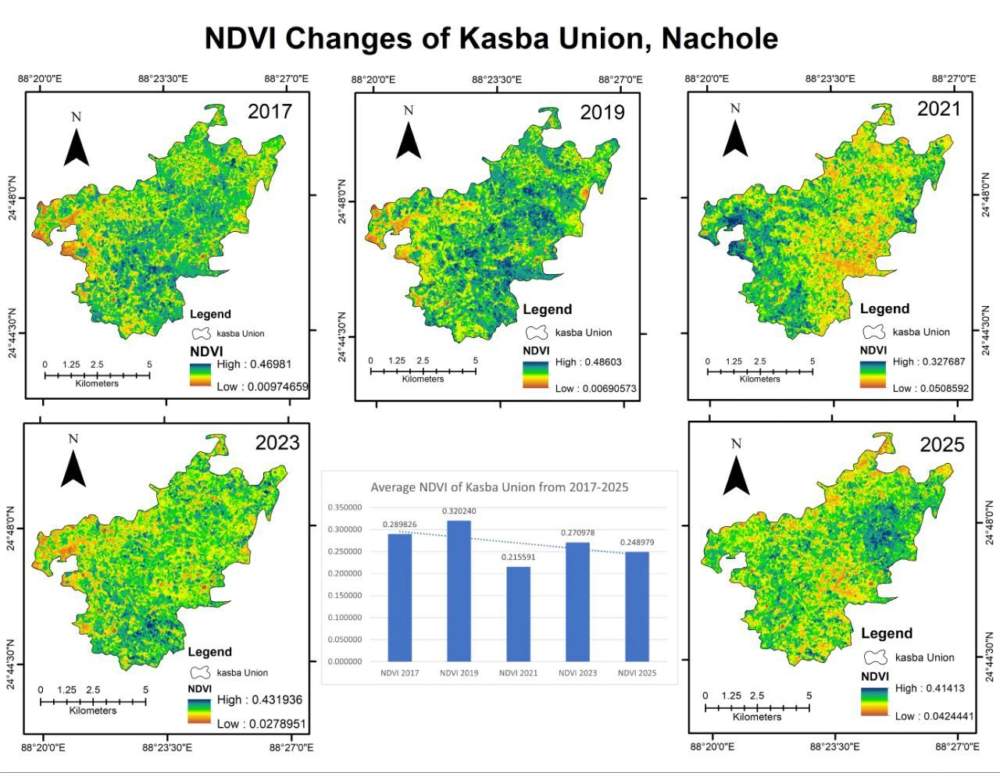

# NDVI Changes of Kasba Union, Nachole (2017–2025)



## Overview

This repository presents a **multi-temporal vegetation analysis** of **Kasba Union, Nachole Upazila, Chapainawabganj District, Bangladesh** using **remote sensing and GIS techniques**.

The analysis uses **Landsat 8 satellite imagery** to calculate the **Normalized Difference Vegetation Index (NDVI)** for multiple years: **2017, 2019, 2021, 2023, and 2025**.

The generated NDVI maps illustrate the **spatial distribution and temporal variation of vegetation conditions** in the study area. The analysis helps identify vegetation health patterns and changes over time using satellite-based observations.

---

## Study Area

The study focuses on **Kasba Union**, located in **Nachole Upazila, Chapainawabganj District, Bangladesh**.

This region is largely dependent on **agriculture and vegetation resources**, making vegetation monitoring important for understanding environmental changes and land condition dynamics.

---

## Normalized Difference Vegetation Index (NDVI)

NDVI is one of the most widely used **vegetation indices** derived from satellite imagery. It measures vegetation health and density by comparing the reflectance values of the **Near Infrared (NIR)** and **Red** spectral bands.

The NDVI formula is:

```
NDVI = (NIR - Red) / (NIR + Red)
```

Where:

- **NIR** = Near Infrared Band  
- **Red** = Red Band  

NDVI values range between **-1 and +1**.

| NDVI Value | Interpretation |
|-------------|---------------|
| < 0 | Water bodies |
| 0 – 0.2 | Bare soil / sparse vegetation |
| 0.2 – 0.5 | Moderate vegetation |
| > 0.5 | Dense and healthy vegetation |

Higher NDVI values represent **healthier and denser vegetation**, while lower values indicate **poor vegetation or non-vegetated surfaces**.

---

## Data Source

Satellite imagery used in this analysis:

- **Satellite:** Landsat 8
- **Sensor:** OLI/TIRS
- **Years analyzed:**
  - 2017
  - 2019
  - 2021
  - 2023
  - 2025

The data were obtained from **USGS EarthExplorer**.

---

## Methodology

The NDVI maps were generated using the following steps:

1. Acquisition of Landsat 8 satellite imagery
2. Preprocessing and preparation of raster datasets
3. Extraction of spectral bands (Red and NIR)
4. Calculation of **NDVI**
5. Spatial visualization of vegetation distribution
6. Comparison of NDVI values across multiple years

The analysis allows observation of **temporal changes in vegetation conditions** within the study area.

---

## Tools & Software

The analysis and map preparation were conducted using:

- **ArcMap (ArcGIS Desktop)**
- Remote sensing raster processing tools
- GIS spatial analysis tools
- Cartographic visualization techniques

---

## Repository Contents

```
NDVI
│
├── NDVI.jpeg      # Multi-temporal NDVI maps (2017–2025)
├── README.md      # Project documentation
└── LICENSE        # MIT License
```

---

## Author

**Md. Habibullah Masbah**  
Undergraduate Student  
ID: 2107046  
Department of Urban & Regional Planning  
Rajshahi University of Engineering & Technology (RUET), Bangladesh

---

## License

This project is licensed under the **MIT License**.

See the **LICENSE** file for details.
